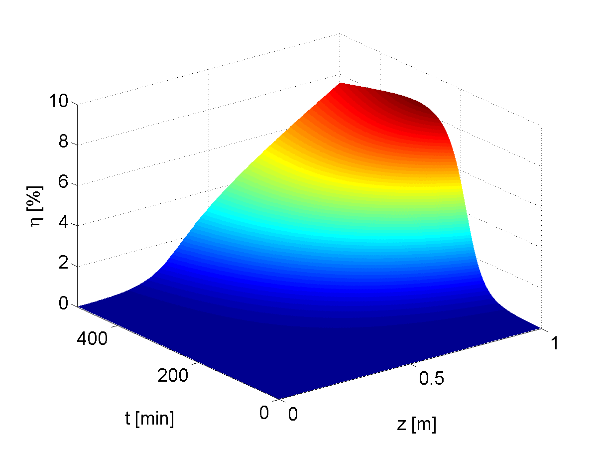

# Second harmonic generation in microstructured fibers with loss beyond 0.01 dB/m
The official repository for my master thesis in physics.

[https://www.osapublishing.org/ol/abstract.cfm?uri=ol-43-12-2791](https://www.osapublishing.org/ol/abstract.cfm?uri=ol-43-12-2791)

## Table of contents
* [General info](#general-info)
* [Programming language](#technologies)
* [Citation](#citation)
* [Status](#status)

## General info
Optical fibers are excellent structures for studying nonlinear optics because 
they allow light to propagate over long distances. At the same time, 
an optical power reaches a high concentration in the optical fibers' core, 
resulting in a high optical intensity. On the other hand, the limitation of silica fibers, 
in the context of investigating nonlinear optical phenomena, 
is the centrosymmetricity of this material. 
It leads directly to the zero value of a nonlinear second-order susceptibility. 
The second limitation is that a phase matching cannot be satisfied in this media 
for the fundamental modes at different wavelength. 
As a result the second harmonic generation (SHG) should not be efficient. 
However, sometimes routine experiments show unexpected effects.


In my study I extended a theoretical model of the self-organized second harmonic generation 
to include an attenuation and investigated the influence of fiber loss on the self-organized SHG process. 
I was perform calculations of energy conversion efficiency for the second harmonic generation 
in microstructured optical fibers. Finally, I referred the simulation results to measured SHG efficiency 
in a microstructured side-hole germanium doped fiber. The extended model should be applied 
for the fibers with loss beyond 0.01 dB/m. My results point out, that even in such fibers, 
efficient SHG without an external second-harmonic beam is possible.



## Technologies used
* Matlab

## Citation

```
@article{Majchrowska:18,
    author = {Sylwia Majchrowska and Jakub Pabisiak and Tadeusz Martynkien and Pawe{\l} Mergo and Karol Tarnowski},
    journal = {Opt. Lett.},
    number = {12},
    pages = {2791--2794},
    publisher = {OSA},
    title = {Influence of attenuation on self-organized second-harmonic generation in a germanium-doped microstructured silica fiber},
    volume = {43},
    month = {Jun},
    year = {2018},
}
```

## Status
Project is: _finished_
